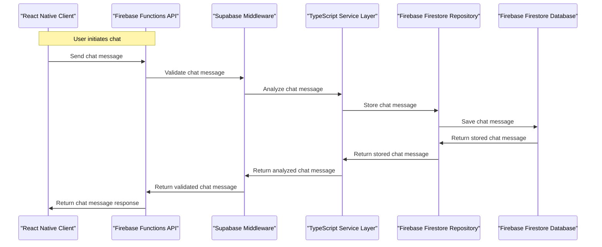
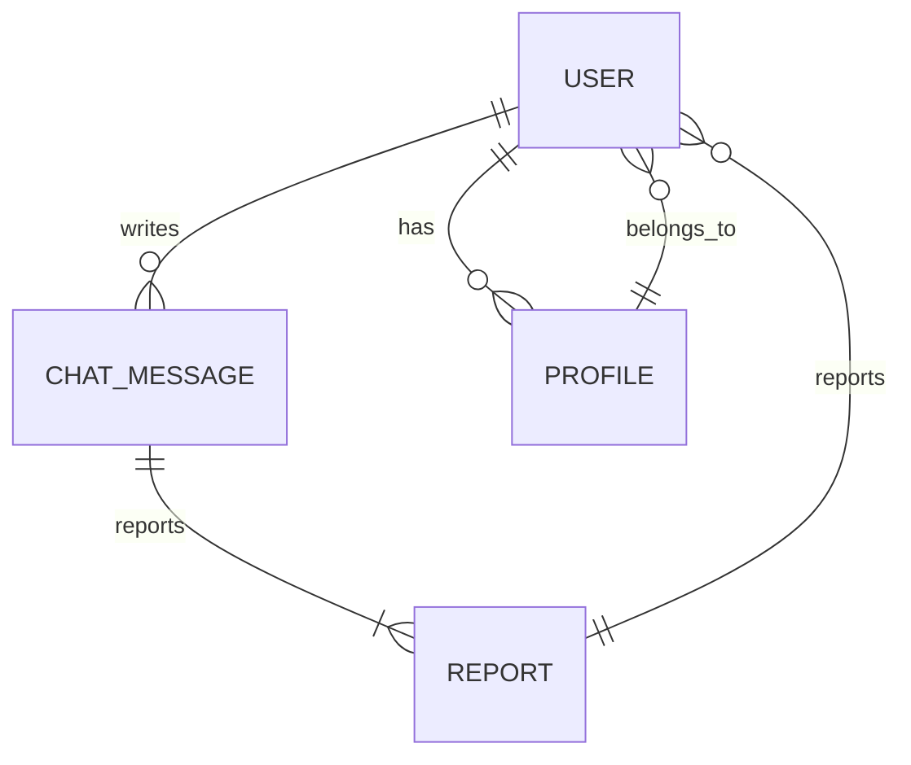

# Sugar Baby Detector
### MVP Architecture Document
> **Team:** talha ? **Duration:** 12 weeks ? **Stack:** React Native, TypeScript, Expo, Firebase, Supabase

---

## 1. Executive Summary
The Sugar Baby Detector is a mobile application designed to detect and prevent sugar baby relationships. The app will use AI-powered chat analysis and community reporting to identify potential sugar baby relationships. The end-user experience will involve users chatting with the app's AI-powered chatbot, which will analyze the conversations and provide warnings if suspicious behavior is detected. The app will also allow users to report suspicious activity, which will be reviewed by the app's moderators.

The core problem that the Sugar Baby Detector solves is the lack of proactive solutions to prevent sugar baby relationships. Current solutions focus on symptom detection rather than prevention, which can lead to harm and exploitation. The Sugar Baby Detector aims to fill this gap by providing a proactive and preventive solution.

The value that the Sugar Baby Detector delivers is the ability to detect and prevent sugar baby relationships before they become harmful. The app's AI-powered chat analysis and community reporting features will provide users with a safe and secure way to interact with others, while also helping to prevent exploitation and harm.

## 2. System Architecture Overview

### 2.1 High-Level Architecture Diagram
```
+---------------+
|  Client    |
|  (React Native) |
+---------------+
       |
       |
       v
+---------------+
|  API Layer  |
|  (Firebase Functions) |
+---------------+
       |
       |
       v
+---------------+
|  Middleware  |
|  (Supabase)    |
+---------------+
       |
       |
       v
+---------------+
|  Service Layer |
|  (TypeScript)  |
+---------------+
       |
       |
       v
+---------------+
|  Repository Layer |
|  (Firebase Firestore) |
+---------------+
       |
       |
       v
+---------------+
|  Database     |
|  (Firebase Firestore) |
+---------------+
```

### 2.2 Request Flow Diagram (Mermaid)


### 2.3 Architecture Pattern
The Sugar Baby Detector will use a layered architecture pattern, which consists of a client layer, API layer, middleware layer, service layer, repository layer, and database layer. This pattern is suitable for this team size and timeline because it allows for a clear separation of concerns and makes it easier to maintain and scale the application.

### 2.4 Component Responsibilities
The client layer is responsible for handling user interactions and rendering the user interface. It does not own the business logic or data storage, and it communicates with the API layer to send and receive data.

The API layer is responsible for handling incoming requests and sending responses to the client. It owns the API endpoints and handles validation and authentication. It communicates with the middleware layer to validate and analyze incoming requests.

The middleware layer is responsible for validating and analyzing incoming requests. It owns the validation and analysis logic and communicates with the service layer to perform business logic operations.

The service layer is responsible for performing business logic operations. It owns the business logic and communicates with the repository layer to store and retrieve data.

The repository layer is responsible for storing and retrieving data. It owns the data access logic and communicates with the database layer to store and retrieve data.

The database layer is responsible for storing and retrieving data. It owns the data storage and retrieval logic.

## 3. Tech Stack & Justification

| Layer | Technology | Why chosen |
|-------|-----------|------------|
| Client | React Native | Chosen for its cross-platform compatibility and ease of development |
| API | Firebase Functions | Chosen for its serverless architecture and ease of deployment |
| Middleware | Supabase | Chosen for its robust middleware capabilities and ease of integration |
| Service | TypeScript | Chosen for its type safety and ease of development |
| Repository | Firebase Firestore | Chosen for its NoSQL database capabilities and ease of integration |
| Database | Firebase Firestore | Chosen for its NoSQL database capabilities and ease of integration |

## 4. Database Design

### 4.1 Entity-Relationship Diagram


### 4.2 Relationship & Association Details
The relationship between a user and a chat message is one-to-many, meaning a user can write many chat messages. The relationship is enforced at the database level using foreign keys. The join strategy is to use a separate query to retrieve the chat messages for a given user.

The relationship between a chat message and a report is one-to-many, meaning a chat message can be reported many times. The relationship is enforced at the database level using foreign keys. The join strategy is to use a separate query to retrieve the reports for a given chat message.

The relationship between a user and a report is one-to-many, meaning a user can report many chat messages. The relationship is enforced at the database level using foreign keys. The join strategy is to use a separate query to retrieve the reports for a given user.

The relationship between a user and a profile is one-to-one, meaning a user has one profile. The relationship is enforced at the database level using foreign keys. The join strategy is to use a separate query to retrieve the profile for a given user.

### 4.3 Schema Definitions (Code)
```typescript
// user.entity.ts
import { Entity, Column, PrimaryGeneratedColumn, OneToMany } from 'typeorm';
import { ChatMessage } from './chat-message.entity';
import { Report } from './report.entity';
import { Profile } from './profile.entity';

@Entity()
export class User {
  @PrimaryGeneratedColumn()
  id: number;

  @Column()
  name: string;

  @OneToMany(() => ChatMessage, (chatMessage) => chatMessage.user)
  chatMessages: ChatMessage[];

  @OneToMany(() => Report, (report) => report.user)
  reports: Report[];

  @OneToOne(() => Profile, (profile) => profile.user)
  profile: Profile;
}

// chat-message.entity.ts
import { Entity, Column, PrimaryGeneratedColumn, ManyToOne } from 'typeorm';
import { User } from './user.entity';
import { Report } from './report.entity';

@Entity()
export class ChatMessage {
  @PrimaryGeneratedColumn()
  id: number;

  @Column()
  text: string;

  @ManyToOne(() => User, (user) => user.chatMessages)
  user: User;

  @OneToMany(() => Report, (report) => report.chatMessage)
  reports: Report[];
}

// report.entity.ts
import { Entity, Column, PrimaryGeneratedColumn, ManyToOne } from 'typeorm';
import { User } from './user.entity';
import { ChatMessage } from './chat-message.entity';

@Entity()
export class Report {
  @PrimaryGeneratedColumn()
  id: number;

  @Column()
  reason: string;

  @ManyToOne(() => User, (user) => user.reports)
  user: User;

  @ManyToOne(() => ChatMessage, (chatMessage) => chatMessage.reports)
  chatMessage: ChatMessage;
}

// profile.entity.ts
import { Entity, Column, PrimaryGeneratedColumn, OneToOne } from 'typeorm';
import { User } from './user.entity';

@Entity()
export class Profile {
  @PrimaryGeneratedColumn()
  id: number;

  @Column()
  bio: string;

  @OneToOne(() => User, (user) => user.profile)
  user: User;
}
```

### 4.4 Indexing Strategy
The indexing strategy for the database is to use a combination of single-field and compound indexes to optimize query performance.

For the `users` table, a single-field index on the `id` column is used to optimize queries that retrieve a user by their ID.

For the `chat_messages` table, a compound index on the `user_id` and `created_at` columns is used to optimize queries that retrieve chat messages for a given user.

For the `reports` table, a compound index on the `user_id` and `chat_message_id` columns is used to optimize queries that retrieve reports for a given user and chat message.

### 4.5 Data Flow Between Entities
The data flow between entities is as follows:

1. A user creates a chat message, which is stored in the `chat_messages` table.
2. A user can report a chat message, which creates a new report in the `reports` table.
3. A user's profile is stored in the `profiles` table and is associated with the user through a foreign key.

## 5. API Design

### 5.1 Authentication & Authorization
The API uses JSON Web Tokens (JWT) for authentication and authorization. When a user logs in, a JWT token is generated and returned to the client. The client then includes the JWT token in the `Authorization` header of all subsequent requests. The API verifies the JWT token on each request and checks the user's permissions to access the requested resource.

### 5.2 REST Endpoints
```markdown
| Method | Path | Auth | Request Body | Response | Description |
|--------|------|------|--------------|----------|-------------|
| GET | /users | yes | - | User[] | Retrieve a list of all users |
| GET | /users/{id} | yes | - | User | Retrieve a user by ID |
| POST | /users | no | { name, email, password } | User | Create a new user |
| PUT | /users/{id} | yes | { name, email, password } | User | Update a user |
| DELETE | /users/{id} | yes | - | - | Delete a user |
| GET | /chat-messages | yes | - | ChatMessage[] | Retrieve a list of all chat messages |
| GET | /chat-messages/{id} | yes | - | ChatMessage | Retrieve a chat message by ID |
| POST | /chat-messages | yes | { text } | ChatMessage | Create a new chat message |
| PUT | /chat-messages/{id} | yes | { text } | ChatMessage | Update a chat message |
| DELETE | /chat-messages/{id} | yes | - | - | Delete a chat message |
| GET | /reports | yes | - | Report[] | Retrieve a list of all reports |
| GET | /reports/{id} | yes | - | Report | Retrieve a report by ID |
| POST | /reports | yes | { reason, chatMessageId } | Report | Create a new report |
| PUT | /reports/{id} | yes | { reason, chatMessageId } | Report | Update a report |
| DELETE | /reports/{id} | yes | - | - | Delete a report |
```

### 5.3 Error Handling
The API uses a standard error response format, which includes the following fields:

* `status`: The HTTP status code of the error
* `message`: A human-readable description of the error
* `details`: Additional details about the error, such as the field that caused the error

For example:
```json
{
  "status": 400,
  "message": "Invalid request",
  "details": {
    "field": "email",
    "error": "Email is required"
  }
}
```

## 6. Frontend Architecture

### 6.1 Folder Structure
The frontend code is organized into the following folders:

* `components`: Reusable UI components
* `containers`: Components that wrap other components and provide additional functionality
* `screens`: Top-level screens that render the app's content
* `utils`: Utility functions that are used throughout the app
* `api`: API client functions that interact with the backend API

### 6.2 State Management
The app uses a combination of React Context and Redux to manage state. The React Context is used to store the user's authentication state, while Redux is used to store the app's data state.

### 6.3 Key Pages & Components
The app has the following key pages and components:

* `LoginScreen`: A screen that renders the login form and handles user authentication
* `ChatScreen`: A screen that renders the chat interface and handles user input
* `ReportScreen`: A screen that renders the report form and handles report submission
* `UserComponent`: A component that renders a user's profile information
* `ChatMessageComponent`: A component that renders a single chat message
* `ReportComponent`: A component that renders a single report

## 7. Core Feature Implementation

### 7.1 AI-Powered Chat Analysis
The app uses a machine learning model to analyze user chat messages and detect potential sugar baby relationships. The model is trained on a dataset of labeled chat messages and uses natural language processing techniques to identify suspicious language patterns.

The user flow for this feature is as follows:

1. The user sends a chat message to the API.
2. The API passes the chat message to the machine learning model for analysis.
3. The model analyzes the chat message and returns a score indicating the likelihood of a sugar baby relationship.
4. The API stores the score in the database and returns a response to the user.

The frontend component that handles this feature is the `ChatMessageComponent`. The component sends a request to the API to analyze the chat message and displays the result to the user.

The API endpoint for this feature is `POST /chat-messages/analyze`. The request body includes the chat message text, and the response includes the analysis result.

The backend logic for this feature is as follows:

1. The API receives the chat message and passes it to the machine learning model for analysis.
2. The model analyzes the chat message and returns a score indicating the likelihood of a sugar baby relationship.
3. The API stores the score in the database and returns a response to the user.

The database table that stores the analysis result is the `chat_messages` table. The table includes a column for the analysis score.

The AI integration for this feature uses a machine learning model trained on a dataset of labeled chat messages. The model is deployed as a cloud function that can be called by the API.

The code snippet for this feature is as follows:
```typescript
// chat-message.component.ts
import React, { useState, useEffect } from 'react';
import { api } from '../api';

const ChatMessageComponent = () => {
  const [analysisResult, setAnalysisResult] = useState(null);

  const handleSendMessage = (message) => {
    api.post('/chat-messages/analyze', { text: message })
      .then((response) => {
        setAnalysisResult(response.data);
      })
      .catch((error) => {
        console.error(error);
      });
  };

  return (
    <div>
      <input type="text" placeholder="Type a message" />
      <button onClick={handleSendMessage}>Send</button>
      {analysisResult && (
        <p>Analysis result: {analysisResult.score}</p>
      )}
    </div>
  );
};

export default ChatMessageComponent;
```

### 7.2 Community Reporting
The app allows users to report suspicious activity to the moderators. The user flow for this feature is as follows:

1. The user clicks the "Report" button on a chat message.
2. The app sends a request to the API to create a new report.
3. The API creates a new report and stores it in the database.
4. The API returns a response to the user indicating that the report was created successfully.

The frontend component that handles this feature is the `ReportComponent`. The component sends a request to the API to create a new report and displays the result to the user.

The API endpoint for this feature is `POST /reports`. The request body includes the report details, and the response includes the report ID.

The backend logic for this feature is as follows:

1. The API receives the report request and validates the input data.
2. The API creates a new report and stores it in the database.
3. The API returns a response to the user indicating that the report was created successfully.

The database table that stores the report is the `reports` table. The table includes columns for the report details and the user who created the report.

The code snippet for this feature is as follows:
```typescript
// report.component.ts
import React, { useState, useEffect } from 'react';
import { api } from '../api';

const ReportComponent = () => {
  const [reportId, setReportId] = useState(null);

  const handleCreateReport = (reportDetails) => {
    api.post('/reports', reportDetails)
      .then((response) => {
        setReportId(response.data.id);
      })
      .catch((error) => {
        console.error(error);
      });
  };

  return (
    <div>
      <input type="text" placeholder="Reason for report" />
      <button onClick={handleCreateReport}>Report</button>
      {reportId && (
        <p>Report created successfully: {reportId}</p>
      )}
    </div>
  );
};

export default ReportComponent;
```

## 8. Security Considerations

The app uses a combination of security measures to protect user data and prevent abuse. These measures include:

* Input validation: The app validates all user input data to prevent SQL injection and cross-site scripting (XSS) attacks.
* Authentication and authorization: The app uses JSON Web Tokens (JWT) to authenticate and authorize users.
* Data encryption: The app encrypts all data stored in the database using a secure encryption algorithm.
* Rate limiting: The app limits the number of requests that can be made to the API within a certain time period to prevent abuse.
* CORS policy: The app uses a strict CORS policy to prevent cross-site request forgery (CSRF) attacks.

## 9. MVP Scope Definition

### 9.1 In Scope (MVP)
The following features are included in the MVP:

* User registration and login
* Chat messaging
* AI-powered chat analysis
* Community reporting

### 9.2 Out of Scope (Post-MVP)
The following features are not included in the MVP:

* User profiles
* Chat message editing and deletion
* Report moderation

### 9.3 Success Criteria
The following success criteria are used to determine if the MVP is complete:

* Users can register and log in to the app
* Users can send and receive chat messages
* The app can analyze chat messages using AI and return a score indicating the likelihood of a sugar baby relationship
* Users can report suspicious activity to the moderators

## 10. Week-by-Week Implementation Plan

The following is a week-by-week implementation plan for the MVP:

Week 1-2: User registration and login

* Focus: Implement user registration and login functionality
* Deliverable: Working user registration and login screens
* Done-when: Users can register and log in to the app

Week 3-4: Chat messaging

* Focus: Implement chat messaging functionality
* Deliverable: Working chat messaging screens
* Done-when: Users can send and receive chat messages

Week 5-6: AI-powered chat analysis

* Focus: Implement AI-powered chat analysis functionality
* Deliverable: Working chat analysis screens
* Done-when: The app can analyze chat messages using AI and return a score indicating the likelihood of a sugar baby relationship

Week 7-8: Community reporting

* Focus: Implement community reporting functionality
* Deliverable: Working report screens
* Done-when: Users can report suspicious activity to the moderators

Week 9-10: Testing and debugging

* Focus: Test and debug the app
* Deliverable: A stable and functional app
* Done-when: The app is stable and functional

Week 11-12: Launch preparation

* Focus: Prepare the app for launch
* Deliverable: A launched app
* Done-when: The app is launched and available to users

## 11. Testing Strategy

The following is a testing strategy for the app:

| Type | Tool | What is tested | Target coverage |
|------|------|---------------|-----------------|
| Unit | Jest | Individual components and functions | 80% |
| Integration | Cypress | API endpoints and user flows | 80% |
| End-to-end | Selenium | User flows and app functionality | 80% |

## 12. Deployment & DevOps

### 12.1 Local Development Setup
The following are the steps to set up the app for local development:

1. Clone the repository from GitHub
2. Install the dependencies using npm or yarn
3. Start the app using npm or yarn

### 12.2 Environment Variables
The following are the environment variables required to run the app:

* `API_KEY`: The API key for the machine learning model
* `DB_URL`: The URL of the database
* `JWT_SECRET`: The secret key for JWT authentication

### 12.3 Production Deployment
The app will be deployed to a cloud platform such as AWS or Google Cloud. The deployment will include the following steps:

1. Build the app using npm or yarn
2. Deploy the app to the cloud platform
3. Configure the environment variables
4. Start the app

## 13. Risk Register

The following are the risks associated with the app:

| Risk | Likelihood | Impact | Mitigation |
|------|-----------|--------|-----------|
| Technical debt | High | Medium | Regular code reviews and refactoring |
| Security vulnerabilities | High | High | Regular security audits and penetration testing |
| User adoption | Medium | High | Marketing and user engagement strategies |
| Competition | Medium | Medium | Continuous monitoring of the market and competition |
| Regulatory compliance | Low | High | Regular review of regulatory requirements and compliance |